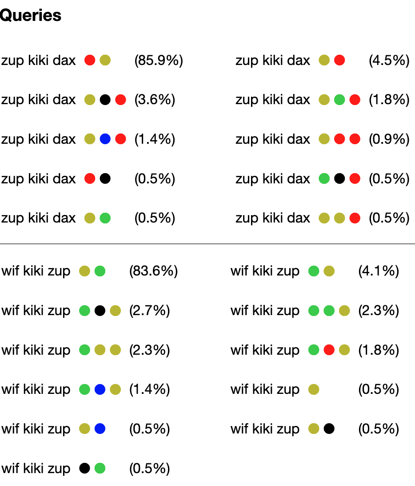

# Meta-Learning for Compositionality (MLC) for modeling human behavior

Meta-Learning for Compositionality (MLC) is an optimization procedure that encourages systematicity through a series of few-shot compositional tasks. This code shows how to train and evaluate a sequence-to-sequence (seq2seq) transformer in PyTorch to implement MLC for modeling human behavior.

**A [separate repository here](https://github.com/brendenlake/MLC-ML) has code for applying MLC to machine learning benchmarks, including SCAN and COGS.**

**Note: Users can regard the acronym BIML as synonymous with MLC. The approach was renamed to MLC after the code was written.**

## Citation
Please cite the following article if you use any of this code in your work:
- [Lake, B. M. and Baroni, M. (2023). Human-like systematic generalization through a meta-learning neural network.](https://www.nature.com/articles/s41586-023-06668-3.pdf) Nature, 623, 115-121. 

## Credits
This repo borrows from the excellent [PyTorch seq2seq tutorial](https://pytorch.org/tutorials/beginner/translation_transformer.html).

## Requirements
Python 3 with the following packages (install time within minutes):
torch (PyTorch), sklearn (scikit-learn), numpy, matplotlib

The specific versions used for development:
Python (3.7.9), PyTorch (1.10.1), sklean (0.24.2), numpy (1.21.5), matplotlib (3.3.2)

## Downloading data and pre-trained models

**Meta-training data**  
To get the episodes used for meta-training, you should download the following [zip file](https://cims.nyu.edu/~brenden/supplemental/BIML-large-files/data_algebraic.zip) with the 100K meta-training episodes. Please extract `data_algebraic.zip` such that `data_algebraic`is a sub-directory of the main repo.

**Pre-trained models**  
To get the top pre-trained models, you should download the following [zip file](https://cims.nyu.edu/~brenden/supplemental/BIML-large-files/BIML_top_models.zip). Please extract `BIML_top_models.zip` such that `out_models` is a sub-directory of the main repo and contains the model files `net-BIML-*.pt`.

## Evaluating models
There are many different ways to evaluate a model after training, each of which should take less than a minute on a standard desktop. Here are a few examples.

### Generating algebraic outputs on few-shot learning task 
Here we find the best response from the pre-trained MLC model using greedy decoding:
```python
python eval.py  --max --episode_type few_shot_gold --fn_out_model net-BIML-top.pt --verbose
```

### Evaluating human responses on few-shot learning task (using log-likelihood)
Here we evaluate the log-likelihood of the human data:
```python
python eval.py  --ll --ll_nrep 100 --episode_type few_shot_human --ll_p_lapse 0.03 --fn_out_model net-BIML-top.pt
```
To evaluate the log-likelihood of all models and to reproduce Table 1 in the manuscript, you can run this command for the various models. Please see the table below for how to set the arguments in each case. Note that due to system/version differences, the log-likelihood values may vary in minor ways from the paper.  

| --fn_out_model            | --ll_p_lapse | --episode_type |
|---------------------------|--------------|----------------|
| net-basic-seq2seq-top.pt  | 0.9          |human_vanilla   |
| net-BIML-copy-top.pt      | 0.5          |few_shot_human  |
| net-BIML-algebraic-top.pt | 0.1          |few_shot_human  |
| net-BIML-joint-top.pt     | 0.03         |few_shot_human  |
| net-BIML-top.pt           | 0.03         |few_shot_human  |


###  Sampling model responses for the few-shot learning task
The models can be asked to mimic human responses on few-shot learning. To do so, the models sample from their distribution of possible outputs. A full set of samples from the models is available on [this webpage](https://cims.nyu.edu/~brenden/supplemental/BIML-supp-results/sysgen.html). To reproduce the results for MLC (or other models), you can type the following to generate a HTML page.
```python
python eval.py --episode_type few_shot_human_mult10 --sample_html --fn_out_model net-BIML-top.pt
```
Then, after ensuring the right file name is listed under `__main__` in the script `analysis_few_shot.py`, you can compare the human and machine mistakes
```python
cd html_output/few_shot_human_mult10
python analysis_few_shot.py
```
This should reproduce the hosted HTML file and numbers reported in the paper. Small variations may arise through version differences.  Here is a snippet of the HTML and the text output.  

```
Human responses (item accuracy):
   DAX after 1 : 86.364
  ...
  mean overall acc.: 80.739
  mean acc. on simple queries: 85.479
  mean acc. on complex queries: 76.0
  mean acc. on len=6 queries: 72.5
  perc. of errors that are one2one:  24.39 ; 10 of 41
  perc. of errors (involving "after") that are iconic :  23.333 ; 7 of 30
Model responses (item accuracy):
   DAX after 1 : 85.909
  ...
  mean overall acc.: 82.376
  mean acc. on simple queries: 86.252
  mean acc. on complex queries: 78.5
  mean acc. on len=6 queries: 77.75
  perc. of errors that are one2one:  56.267 ; 211 of 375
  perc. of errors (involving "after") that are iconic :  13.83 ; 39 of 282

Correlation for item accuracies: r= 0.788 ; p= 0.007
Generating HTML file: human_few_shot_behavior.html
```

### Sampling model responses for the open-ended task
The models can be asked to mimic human responses on the open-ended task. Again, a full set of samples from the models is available on [this webpage](https://cims.nyu.edu/~brenden/supplemental/BIML-supp-results/sysgen.html). To reproduce the results for MLC, you can type the following two commands to generate a HTML page.
```python
python eval.py --episode_type open_end_freeform --sample_iterative --fn_out_model net-BIML-open-ended-top.pt
```
Then, after ensuring the right file name is listed under `__main__` in the script `analysis_freeform.py`, you can compare the human and machine mistakes
```python
cd html_output/open_end_freeform
python analysis_freeform.py
```
This should reproduce the hosted HTML file and numbers reported in the paper. Small variations may arise through version differences. Here is a snippet of the HTML and the text output.  

```
Human:
   Processing 29 human participants.
   Percent with perfect maps (consistent with 3 inductive biases): 58.621 ; N= 17 of 29
   Percent with one2one maps: 62.069 ; N= 18 of 29
   Percent with iconic concatenation: 79.31 ; N= 23 of 29
   Percent with ME maps: 93.103 ; N= 27 of 29
Model:
   Processing 100 model samples.
   Percent with perfect maps (consistent with 3 inductive biases): 65.0 ; N= 65 of 100
   Percent with one2one maps: 66.0 ; N= 66 of 100
   Percent with iconic concatenation: 85.0 ; N= 85 of 100
   Percent with ME maps: 99.0 ; N= 99 of 100
Generating HTML file: human_open_end_freeform.html
Generating HTML file: open_end_freeform_net-BIML-open-ended-top.html
```

The full set of evaluation arguments can be viewed with when typing `python eval.py -h`:
```
optional arguments:
  -h, --help            show this help message and exit
  --fn_out_model FN_OUT_MODEL
                        *REQUIRED*. Filename for loading the model
  --dir_model DIR_MODEL
                        Directory for loading the model file
  --max_length_eval MAX_LENGTH_EVAL
                        Maximum generated sequence length
  --batch_size BATCH_SIZE
                        Number of episodes in batch
  --episode_type EPISODE_TYPE
                        What type of episodes do we want? See datasets.py for
                        options
  --dashboard           Showing loss curves during training.
  --ll                  Evaluate log-likelihood of validation (val) set
  --max                 Find best outputs for val commands (greedy decoding)
  --sample              Sample outputs for val commands
  --sample_html         Sample outputs for val commands in html format (using
                        unmap to canonical text)
  --sample_iterative    Sample outputs for val commands iteratively
  --fit_lapse           Fit the lapse rate
  --ll_nrep LL_NREP     Evaluate each episode this many times when computing
                        log-likelihood (needed for stochastic remappings)
  --ll_p_lapse LL_P_LAPSE
                        Lapse rate when evaluating log-likelihoods
  --verbose             Inspect outputs in more detail
```

## Episode types
Please see `datasets.py` for the full set of options. Here are a few key episode types that can be set via `--episode_type`:
- `algebraic+biases` : For meta-training. Corresponds to "MLC" in Table 1 and main results
- `algebraic_noise` : For meta-training. Corresponds to "MLC (algebraic only)" in Table 1 and main results
- `retrieve` : For meta-training. Correspond to "MLC (copy only)" in Table 1 and main results
- `few_shot_gold` : For evaluating MLC on the prescribed algebraic responses for the few-shot learning task. (test only)
- `few_shot_human` : For evaluating MLC on predicting human responses for the few-shot learning task. (test only)
- `few_shot_human_mult10` : For evaluating MLC on predicting human responses for the few-shot learning task (human data up-sampled/repeated 10x). (test only)
- `open_end_freeform` : For generating MLC responses on open-ended task. Here, the models iteratively fill out responses one-by-one. (test only)

## Training models from scratch
To train MLC on few-shot learning (as in the MLC model in Fig. 2 and Table 1), you can run the `train` command with default arguments:
```python
python train.py --episode_type algebraic+biases --fn_out_model net-BIML.pt
```
which will produce a file `out_models/net-BIML.pt`. 

The full set of training arguments can be viewed with `python train.py -h`:
```
optional arguments:
  -h, --help            show this help message and exit
  --fn_out_model FN_OUT_MODEL
                        *REQUIRED* Filename for saving model checkpoints.
                        Typically ends in .pt
  --dir_model DIR_MODEL
                        Directory for saving model files
  --episode_type EPISODE_TYPE
                        What type of episodes do we want? See datasets.py for
                        options
  --batch_size BATCH_SIZE
                        number of episodes per batch
  --nepochs NEPOCHS     number of training epochs
  --lr LR               learning rate
  --lr_end_factor LR_END_FACTOR
                        factor X for decrease learning rate linearly from
                        1.0*lr to X*lr across training
  --no_lr_warmup        Turn off learning rate warm up (by default, we use 1
                        epoch of warm up)
  --nlayers_encoder NLAYERS_ENCODER
                        number of layers for encoder
  --nlayers_decoder NLAYERS_DECODER
                        number of layers for decoder
  --emb_size EMB_SIZE   size of embedding
  --ff_mult FF_MULT     multiplier for size of the fully-connected layer in
                        transformer
  --dropout DROPOUT     dropout applied to embeddings and transformer
  --act ACT             activation function in the fully-connected layer of
                        the transformer (relu or gelu)
  --save_best           Save the "best model" according to validation loss.
  --save_best_skip SAVE_BEST_SKIP
                        Do not bother saving the "best model" for this
                        fraction of early training
  --resume              Resume training from a previous checkpoint
```                       
